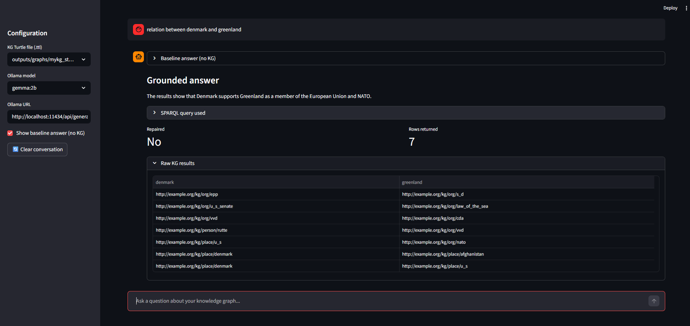

# 🌍 Geo-KG-RAG
> From web data to a knowledge graph-powered AI assistant for geopolitical analysis.

[](https://www.python.org/)
[](LICENSE)

---

## 📌 Project Overview

This project transforms unstructured web data into a structured **Knowledge Graph (KG)**
and uses it to power an AI assistant through **Retrieval-Augmented Generation (RAG)**.

The domain focuses on **Greenland and Arctic geopolitics** (2025–2026): Trump's
statements on Greenland acquisition, NATO Arctic defense, and Denmark's response.

**Pipeline:**
```
Web Crawling → NER & Relation Extraction → RDF Knowledge Graph
    → Entity Linking (Wikidata) → KB Expansion → SWRL Reasoning
    → KGE Training (TransE / RotatE / DistMult) → RAG Assistant
```

**Key results:**
- 62,082 triples, 4,315 entities, 2,020 predicates
- RotatE MRR = **0.834** (30× improvement over DBpedia baseline)
- RAG chatbot with NL→SPARQL generation and self-repair

---

## 🏗️ Project Structure
```
geo_kg_rag/
├── src/
│   ├── crawling.py             # Web crawling with Trafilatura
│   ├── kg_builder.py           # RDF graph construction
│   ├── entity_linking.py       # Wikidata entity linking
│   ├── predicate_alignment.py  # Predicate alignment
│   ├── sparql_expansion.py     # Wikidata 1-hop expansion
│   ├── swrl_reasoning.py       # SWRL rule inference
│   ├── stats.py                # KB statistics
│   ├── rag_pipeline.py         # RAG pipeline (NL→SPARQL)
│   ├── rag_ui_app.py           # Streamlit chatbot UI
│   ├── namespaces.py           # RDF namespace definitions
│   └── utils.py                # Shared utilities
├── scripts/
│   ├── run_crawling.py
│   ├── run_kg_builder.py
│   ├── run_entity_linking.py
│   ├── run_predicate_alignment.py
│   ├── run_sparql_expansion.py
│   ├── run_swrl.py
│   ├── run_stats.py
│   ├── run_rag.py              # CLI RAG demo
│   └── run_ui.py               # Streamlit UI launcher
├── notebooks/
│   └── kge_experiments.ipynb   # KGE training (Google Colab)
├── data/
│   ├── raw/
│   │   └── crawler_output.jsonl
│   ├── kge/
│   │   ├── train.txt
│   │   ├── valid.txt
│   │   └── test.txt
│   └── family.owl
├── outputs/
│   ├── graphs/
│   │   ├── mykg_step1_initial.ttl
│   │   ├── mykg_step2_aligned.ttl
│   │   ├── predicate_alignment_step3.ttl
│   │   ├── mykg_step4_expanded.ttl
│   │   └── ontology_step2.ttl
│   ├── mappings/
│   │   ├── mapping.csv
│   │   └── predicate_candidates.csv
│   └── stats/
│   │   ├── kg_stats_step1.json
│   |   └── kg_stats.json
├── reports/
│   ├── gemma_relation_between_greenland_denmark.png #Demo screenshots
│   ├── gemma_what_is_greenland.png
│   ├──llama_what_is_nato.png
│   ├── llama_who_is_emmanuel_macron.png
│   ├── llama_who_opposes_denmak.png
│   └── final_report.pdf
├── requirements.txt
└── README.md
```

---

## ⚙️ Installation

### Requirements
- Python 3.11+
- 8 GB RAM minimum (16 GB recommended for loading the full KG)
- Windows / macOS / Linux
- Internet connection (for Wikidata API calls during expansion)

### 1. Clone the repository
```bash
git clone https://github.com/SandrineDaniel/geo_kg_rag.git
cd geo_kg_rag
```

### 2. Install Python dependencies
```bash
pip install -r requirements.txt
python -m spacy download en_core_web_lg
```

### 3. Install and start Ollama (for RAG)

Download Ollama from [https://ollama.com](https://ollama.com) and install it.
```bash
# Pull the recommended model
ollama pull llama3.2:1b

# Optional: pull Gemma 2B for better SPARQL generation quality
ollama pull gemma:2b

# Verify Ollama is running
ollama list
```

Ollama runs as a local HTTP server on `http://localhost:11434`.
You can verify it is running by visiting that URL in your browser
— you should see `"Ollama is running"`.

---

## 🔄 How to Run Each Module

Run all scripts from the **project root directory**.

### Step 1 — Web Crawling
```bash
python scripts/run_crawling.py
```

Output: `data/raw/crawler_output.jsonl`

### Step 2 — Knowledge Graph Construction
```bash
python scripts/run_kg_builder.py
```

Output: `outputs/graphs/mykg_step1_initial.ttl`

### Step 3 — Entity Linking (Wikidata)
```bash
python scripts/run_entity_linking.py
```

⚠️ Requires internet access. Uses Wikidata Search API with `sleep=1s` per
request to respect rate limits. Takes ~10 minutes for 300 entities.

Output: `outputs/graphs/mykg_step2_aligned.ttl`, `outputs/mappings/mapping.csv`

### Step 4 — Predicate Alignment
```bash
python scripts/run_predicate_alignment.py
```

Output: `outputs/graphs/predicate_alignment_step3.ttl`

### Step 5 — KB Expansion (Wikidata)
```bash
python scripts/run_sparql_expansion.py
```

⚠️ Requires internet access. Uses Wikidata `wbgetentities` API with `sleep=2s`
per entity. Takes ~15–30 minutes for 338 aligned entities.

Output: `outputs/graphs/mykg_step4_expanded.ttl` (62,082 triples)

### Step 6 — KB Statistics
```bash
python scripts/run_stats.py
```

Output: `outputs/stats/kg_stats.json` , `outputs/stats/kg_stats_step1.json`

### Step 7 — SWRL Reasoning
```bash
python scripts/run_swrl.py
```

Runs two SWRL rules:
- `family.owl`: infers `OldPerson` for persons older than 60
- Geopolitical KB: infers `Adversary` for entities with `ex:oppose` relations

### Step 8 — KGE Training

KGE training is performed on **Google Colab** (GPU T4) due to computation time.

Open `notebooks/kge_experiments.ipynb` in Google Colab and follow the instructions.
Upload `outputs/graphs/mykg_step4_expanded.ttl` to Colab or mount your Google Drive.

Models trained: **TransE**, **RotatE**, **DistMult** (via PyKEEN)

---

## 🤖 How to Run the RAG Demo

Make sure Ollama is running and a model is available before launching the demo.

### Option A — Streamlit Web UI (recommended)
```bash
python -m streamlit run scripts/run_ui.py
```

Then open `http://localhost:8501` in your browser.

In the sidebar:
- Set the KG file to `outputs/graphs/mykg_step4_expanded.ttl`
- Choose a model from the dropdown (`llama3.2:1b` or `gemma:2b`)
- Type your question in the chat box



### Option B — CLI Interactive Mode
```bash
python scripts/run_rag.py \
  --ttl outputs/graphs/mykg_step4_expanded.ttl \
  --model llama3.2:1b
```

### Option C — Single Question
```bash
python scripts/run_rag.py \
  --ttl outputs/graphs/mykg_step4_expanded.ttl \
  --model llama3.2:1b \
  --question "Who opposes Denmark?"
```

**Example questions that work well:**
```
Who opposes Denmark?
What is NATO?
What is Greenland?
Relation between Greenland and Denmark?
```

---

## 💻 Hardware Requirements

| Component | Minimum | Recommended |
|-----------|---------|-------------|
| RAM | 8 GB | 16 GB |
| CPU | Any modern x86-64 | Intel i7 / AMD Ryzen 7 |
| GPU | Not required | T4 (Google Colab for KGE) |
| Storage | 2 GB free | 5 GB free |
| OS | Windows 10 / macOS / Linux | Windows 11 / Ubuntu 22.04 |

> KGE training was performed on **Google Colab (T4 GPU)**.
> The RAG pipeline and all other modules run on CPU only.

---

## 📦 Data & Large Files

The expanded KB (`mykg_step4_expanded.ttl`, ~15 MB) is included in the repository.
The KGE train/valid/test splits are in `data/kge/`.

If files are too large to download directly, use:
```bash
git lfs pull
```

or download them from the [GitHub Release v1.0-final](https://github.com/SandrineDaniel/geo_kg_rag/releases/tag/v1.0-final).

---

## ⚙️ Technologies

| Tool | Version | Purpose |
|------|---------|---------|
| Python | 3.11 | Core language |
| spaCy | 3.x | NER & dependency parsing |
| Trafilatura | 1.x | Web content extraction |
| rdflib | 6.x | RDF graph manipulation |
| OWLReady2 | 0.x | SWRL reasoning |
| PyKEEN | 1.x | KGE training & evaluation |
| Streamlit | 1.x | RAG chatbot UI |
| Ollama | 0.18+ | Local LLM serving |
| Wikidata API | — | Entity linking & expansion |

---

## 👩‍💻 Authors

- **Sandrine Daniel** — DIA4, ESILV 2025/2026
- **Raphael Marques Araujo** — DIA4, ESILV 2025/2026

---

## 📚 Course Context

**Web Data Mining & Semantics** — DIA4, ESILV, 2025/2026
